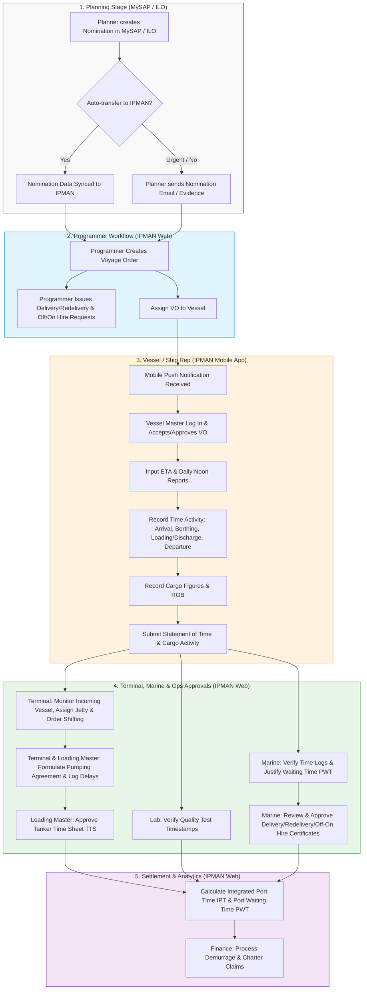

### initial readme title

initial readme content

```mermaid
flowchart TD
subgraph System_Planning ["1. Planning Stage (MySAP / ILO)"]
A[Planner creates Nomination in MySAP / ILO] --> B{Auto-transfer to IPMAN?}
B -- Yes --> C[Nomination Data Synced to IPMAN]
B -- Urgent / No --> D[Planner sends Nomination Email / Evidence]
end

    subgraph System_IPMAN_Web_Prog ["2. Programmer Workflow (IPMAN Web)"]
        C --> E[Programmer Creates Voyage Order]
        D --> E
        E --> F[Programmer Issues Delivery/Redelivery & Off/On Hire Requests]
        E --> G[Assign VO to Vessel]
    end

    subgraph System_IPMAN_Mobile ["3. Vessel / Ship Rep (IPMAN Mobile App)"]
        G --> H[Mobile Push Notification Received]
        H --> I[Vessel Master Log In & Accepts/Approves VO]
        I --> J[Input ETA & Daily Noon Reports]
        J --> K[Record Time Activity: Arrival, Berthing, Loading/Discharge, Departure]
        K --> L[Record Cargo Figures & ROB]
        L --> M[Submit Statement of Time & Cargo Activity]
    end

    subgraph System_IPMAN_Web_Ops ["4. Terminal, Marine & Ops Approvals (IPMAN Web)"]
        M --> N[Terminal: Monitor Incoming Vessel, Assign Jetty & Order Shifting]
        N --> O[Terminal & Loading Master: Formulate Pumping Agreement & Log Delays]
        M --> P[Lab: Verify Quality Test Timestamps]
        M --> Q[Marine: Verify Time Logs & Justify Waiting Time PWT]
        Q --> R[Marine: Review & Approve Delivery/Redelivery/Off-On Hire Certificates]
        O --> S[Loading Master: Approve Tanker Time Sheet TTS]
    end

    subgraph System_IPMAN_Finance ["5. Settlement & Analytics (IPMAN Web)"]
        S --> T[Calculate Integrated Port Time IPT & Port Waiting Time PWT]
        P --> T
        R --> T
        T --> U[Finance: Process Demurrage & Charter Claims]
    end

    %% Styling
    style System_Planning fill:#f9f9f9,stroke:#333,stroke-width:1px
    style System_IPMAN_Web_Prog fill:#e1f5fe,stroke:#0288d1,stroke-width:1px
    style System_IPMAN_Mobile fill:#fff3e0,stroke:#f57c00,stroke-width:1px
    style System_IPMAN_Web_Ops fill:#e8f5e9,stroke:#388e3c,stroke-width:1px
    style System_IPMAN_Finance fill:#f3e5f5,stroke:#7b1fa2,stroke-width:1px
```
